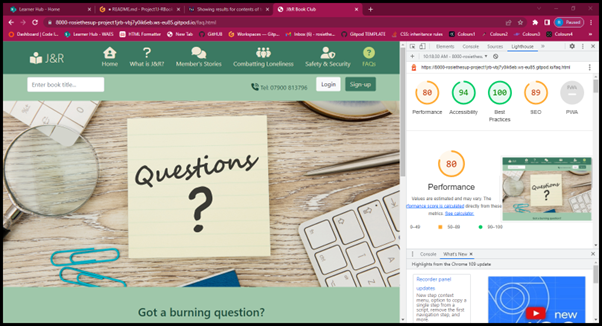

Jean and Rose BookClub

Jean&Rose is a book club founded on connecting older and younger generations in the UK. By proxy this also lends itself to fighting the loneliness pandemic too! We do this by connecting young and old through a love of reading to stimulate the mind, generate conversations and create understanding and friendship. 

When you sign up to Jean&Rose through our webpage we take a few details such as your age and then call you back to ask further questions to find out what your reading level is and your interests. We then pair you with someone of a different generation with whom we think you will connect. One of you picks a book to read, you both read it and speak over the phone once a week (or more or less regularly depending on your preference). Once the first book is finished, then the person who didn't pick the book last time, picks the book this time! 

The idea is that different generations will pick different reading material to each other. As different generations can find it hard to find common ground and to understand each other the idea of Jean&Rose is that open minded individuals will learn about each other theough reading the same material. This should generate interesting topics of conversation, friendship and connection. We do ask that individuals be open to reading something that they might not have picked themselves and be willing to listen to other people's perspectives and opinions with grace. We want people to be able to voice their thoughts and opinions but know that they are doing so to an open minded audience and also be willing to hear opinions that may be very different to their own.

Jean& Rose is for open minded individuals who want to connect.

## CONTENTS  
  
* [UXD (User Experience Design)](#user-experience-ux)
  * [User Stories](#user-stories) 
* [Creation process (Strategy -> Surface)](#creation-process)
  * [Wireframes](#wireframes)
* [Design](#design)
  * [Colour Scheme](#color-scheme)
  * [Typography](#typography)
  * [Imagery](#imagery)
* [Page Features](#page-features)
  * [Navbar](#navbar)
  * [Hero-Image](#hero-image)
  * [Tagline & Call to Action](#tagline--call-to-action)
  * [Business Ethos](#business-ethos)
  * [Menu Page](#menu-page)
  * [Contact Page](#contact-page)
  * [Footer](#footer)  
* [Tablet & Mobile View](#tablet--mobile-view)
  * [Desktop, Tablet & Mobile Differences](#desktop-tablet--mobile-differences)
  * [Tablet View](#tablet-view-ipad-miniipad-prosurface-pro)
  * [Mobile View](#mobile-view-iphone-5iphone-seiphone-xriphone-12-pro)
* [Future Features](#future-features)
* [Technologies Used](#technologies-used)
  * [Languages Used](#languages-used)
  * [Frameworks, Libraries, Technologies & Programs Used](#frameworks-libraries-technologies--programs-used)
* [Deployment](#deployment)
  * [How to deploy](#how-to-deploy)
* [Testing](#testing)
  * [HTML Validation using W3C Validation](#html-validation-using-w3c-validation)
  * [CSS Validation using W3C Validation](#css-validation-using-w3c-validation)
  * [Lighthouse scores via Chrome Developer Tools](#lighthouse-scores-via-chrome-developer-tools)
  * [Bugs & Fixes](#bugs--fixes)
  * [Unsolved Bugs](#unsolved-bugs)
* [Credits](#credits) 

  
---    

## User Experience (UX)  
  
### **User Stories**  

### **Primary Goal**  
  
Jean&Rose aims to connect different generations in order to: generate friendship, connection, common ground, relieve loneliness and improve overall wellbeing of it's target audience. The target audience for Jean&Rose is anyone who enjoys reading, would like to connect with someone of a different generation and would like to improve loneliness and wellbeing either for themselves or for their wider community and the UK as a whole.

### **Visitor Goals** 

With this in mind, Jean&Rose needed to connect with the older generation as well as young people. Considering that the over 65 age group are not always tech savvy and feel apprehensive when using the internet, the site was designed to use calming colours, have very obvious navigation buttons and a "no-tech" way to access and join the bookclub if needed. The site therefore has large icons and everything can be reached within 3 clicks. The green colour palette and large images are there to evoke feelings of calm. Throughout the site there are reminders amongst the content that explain that anyone who would like to join but struggles with using the online world can call the number at the top of the page in order to access the site via the "no-tech" pathway.

Research on my target audience showed that older people who do use the internet have three main areas of concern: security (especially when concerned with financial details being shared), fear of doing something wrong, and a preference to visit somewhere in person. Jean&Rose aims to put some of these concerns to rest by making navigation very easy, by having a "no-tech" option and by having a page dedicated to Safety&Security advice.

All pages are fully responsive so that the site can be viewed on devices of any size. 

### **First Time Visitor**
  - Users can access all areas of the site within 3 clicks. This will avoid cognitive overload.
  - On a desktop, users can see all navigation buttons and the phone number. This means they can access everywhere within one click.
  - On a small screen users can see the "Home" page, "What is J&R" page and "Member's Stories" and "More info" dropdown menu. Once this moves to an extra smaller screen, the Home page icon disappears and the other 3 remain. As J&R is a new idea, I decided it was important to keep the "What is J&R?" as this is something that needs to be explained as soon as possible to the user.
  - On a desktop users can see content hints before the fold of the page. With a tiny scroll they can see what J&R is and how to sign-up.
  - The hero image on the homepage has a quote that talks about books and friendship immediately, so the user will immediately have an idea what the site is about. 
  - The icons help the user to understand without thinking exactly what each page is for.

### **Returning Visitor**  
  - Users can login either via the login button that is visible on the header on a desktop page, or via the dropdown menu on a smaller device. 
  - Users can search for a book via the "search library" bar at the top of the header.
  - If a user would like to get in touch they can do so via the phone number at the top of the page.
  - Users can connect with J&R on social media via the clickable social links in the footer of the page.
  
### **Frequent Visitor**  
  - Again, users can login either via the login button that is visible on the header on a desktop page, or via the dropdown menu on a smaller device.
  - A user can report any concerns via getting in touch with the phone number at the top of the page.  

--- 

## Creation Process  
  
### **1. Strategy**  

- I aimed to develop a simple and easy to use website that gives the public information on what J&R is, why they should join it, how to join it and how it will help to fight loneliness and promote friendship and understanding between different generations.  
- The site needed to explain what J&R was and how to join immediately.
- Business goals and value for the users and creators are explained below: 

#### Business goals:
-	Increase awareness of the brand and existence of the product/service: must be SEO friendly in order to be easily found.
-	Marketing and sales: the process of signing up must be simple, intuitive and easy. Marketing wise the materials on the page must get across the value of joining J&R by showing the benefits for the user themselves and other users. These must include: stimulation of the mind, purpose, easily generated conversation topics, fighting loneliness, new friendships, better understanding of people of different ages and ultimately as a result, a better more connected world and community.

-	USP: This has not been done by anyone else, so the idea itself is unique. But there are other activities that will fight loneliness and these will be alternatives to people. USPs other than the service itself include: that you don’t need to leave your house, you will see things from another person’s point of view, you will use your brain, you won’t have to hold awkward conversations with people because the conversations will be generated by the books you have read. We will provide a list of questions you can ask about each book and people will be able to submit their lists of questions that they asked about books they shared with their buddy. 

-	Safety: You talk over the phone about the book at a set time each week. You don’t ever have to meet your person, but if you do then we recommend coming to one of our pre-organised events for the first meet. These are held by our voluntary hosts around the country. Once you have met in person if you feel safe then you can meet outside of these events too.

-	Security: Need to have several logos and ticks that generate trust and reassurance. Also online safety guidance and safety guidance for meeting up.

-	Audience: young people are tech savvy, but older generation not so. Must be a simple website and must have an option somewhere that says “know someone who would benefit from Jean&Rose who isn’t online?” Need to have a phone number so that people who are not online can get in touch.

#### Value:

##### For users: 

- J&R is a platform to generate friendship, connection and understanding of different ages through reading. It also provides purpose and stimulation of the mind. It is accessible, secure and safe to use. Have a library of titles already included that people can access.

##### For the creators: 

- Subscription fee will cover costs, but is a non for profit organisation that was created to fight loneliness and promote a healthier community. This will give the creator the satisfaction of knowing they have contributed to a better world by promoting understanding, friendship and inter-generational connection.

#### Importance vs Feasibility:

I put together an importance vs feasibility test for the site's first release that took into account my skills as a developer, the time available and the "slow wow" idea behind the service. 

Importance vs Feasibility:
Feature/opportunity	Importance	Feasibility
Library of titles	3	1
Security info	5	5
Safety info	5	5
Subscription fee	3	2
Loneliness information	5	5
What is J&R	5	5
Clickable phone number	5	5
In person events	2	1
Blog	3	1
Testimonials/Peoples’ stories	5	4
Total	41	34

From this I concluded which features should be included in the first release and which would come later. Please see the Scope section below for further details.
  

### **2. Scope**  

#### Functional features on first release:

##### Signing up:
-	Sign-up button and form. This must be easy to use and access.
-	It must be clear that you sign up, then hear from a representative of the organisation who call you back and take more details.
-	Phone number for "no-tech" or "reluctant-tech" audience.
-	Clean, simple design with calming colour palette that relate to older population but also with a dash of youth.
-   Responsive design for all screen sizes.

##### Content requirements for J&R (informational stuff mainly):

-	Diagram of how it works included on homepage.
-	The benefits of joining.
-   What is J&R page.
-   Combatting Loneliness page.
-   Member's Stories page.
-	Safety & security page.
-	FAQs page.
-   Sign up form page.
-   Thank you (for signing up) page.
-   Content should be image heavy with quotes about friendship, connection and having an open mind.

##### Features to be included at LATER release:

- In person events tab: These will be retro events…1940s themed afternoon tea with conversation starters, inter-generational games etc.
-	Library of titles (will include the button on first release for the sake of demonstrating my skills for this project)
-	Subscription fee (will tell people it’s free at the moment but won’t be forever)
-	Blog (in order to talk about the ways J&R can benefit communities)

### **3. Structural**  

-   The main aim with structure was to be: clear, consistent and easy to navigate. I have achieved this by:
-   Navigation: linear narrative is used because it is not necessarily made for the tech savvy so needs to be easy to follow. It takes no more than three clicks to get anywhere.
-   Consistent: colour palette, background will consistently be the same colour, buttons the same colour and will turn to the same different colour when hovering over them. 
-   The site follows a consistent structure too, with the same header and footer appearing on each page. There is also consistency in the use of a large image at the top of each page. Consistency conveys familiarity and trust. It's important to garner this in my users as some of them may view online services with a distinct lack of trust and therefore need to be reassured in as many ways as possible.
-   A "back to top" button is present on every page in order to save the user scrolling. This site is quite text heavy, so the information is organised into cards, boxes and uses the Bootstrap grid system in order to keep information together and displayed in a logical, easy to follow way. I did consider allowing a maximum amount of text, but considering that this is aimed at an audience who like to read, I anticipate that they will like to read quite a lot about something before joining and did not want to stunt the amount of information they could read on the site.
-   There is no need for a "back" button anywhere on the site because the navigation bar appears on every page and means the user can easily come back to it and access any other page on the site with one click.

  
### **4. Skeleton**  

The J&R site was developed to be consistent, trustworthy and easy to navigate.

-   Consistent visual features included on every page were to be: the navigation bar, footer and a large background image.
-   Navigation bar: users can access everything from this within 2 clicks. This is regardless of the size of the screen. The current page icon and page name remain highlighted in lime green so that the user always knows where they are on the site.
-   Navigation on a desktop: the main navigation links are all situated- in accompaniment of their respective icons- to the right of the page, on every page. The J&R logo is always situated on the far left of the page. This is because people read from left to right, so this makes visual sense for the user. The "enter book title" is situated underneath the logo but inline with it. the background colour is different in order to create some contrast and make the "enter book title" stand out. The phone number, "login" and "sign-up" buttons are situated underneath the main navigation buttons on the right. They are on the same contrasting background colour as the "enter book title" feature, which makes them easy to find for the user.

#### Homepage

-   The homepage has a large image that spans the width of the whole page and is overlaid with a quote. The image is of a cosy library, which looks warm and inviting. The quote talks about how people who connect over books become good friends. This image is just below the header, and just below the image you can see hints about the content below the fold.
-   Scrolling just below the image reveals the 4 steps needed to sign-up and benefit from J&R Bookclub. This is accompanied on desktop screens with a large circular central image which shows people talking in a library setting, conveying the idea that they are connecting over books.
-   The page ends with the footer which contains the tagline "For open minded individuals who want to connect". It then has clickable links to 3 social media sites: Instagram, Facebook and Pinterest. These sites were chosen because older audiences use Facebook and Pinterest more than any other social media sites. Younger people use Instagram more, and the use of an image site such as Instagram provides a way for the J&R organisation to further reinforce a positive view of the use of books to connect, stimulate the mind and educate oneself.
- Each social link in the footer opens in a new window, removing the need for a back button and helping the user to navigate their browser experience more easily.

#### What is J&R page

-   Navigation and footer remain as before in order to be consistent and allow easy page navigation.
-   Between these are: a hero image overlaid with a quote. Then there are 3 cards which hold information on: where the idea for J&R came from, the aim of the organisation and the outcome. These are each accompanied by an image which relates to their content.
-   There is then a "back to top" button making navigation of the page easy.

#### Member's Stories page

-   Navigation and footer remain as before in order to be consistant and allow easy page navigation.
-   Between these are: a hero image overlaid with a quote. Then there are 4 cards which hold a testimonial from a happy customer and an  accompanying image.
-   There is then a "back to top" button making navigation of the page easy.

#### Combatting Loneliness page

-   Navigation and footer remain as before in order to be consistant and allow easy page navigation.
-   Between these are: a hero image overlaid with a quote. There then follows are article about loneliness and how bookclubs such as J&R can help. There are 2 images amongst the text to break the article down visually and also to help to convey the messages of the text.
-   There is then a "back to top" button making navigation of the page easy.

#### Safety & Security page

-   Navigation and footer remain as before in order to be consistant and allow easy page navigation.
-   Between these are: a hero image overlaid with the words "Safety & Security". These words are to the left of the page in order to make them visible against the hero image.
-   There then follows 3 cards with accompanying relevant information on safety in person, online and over the phone. The cards give a little summary of the type of information to expect and each has a button which when clicked takes the user to the relevant part of the page with more information.
-   There is then a "back to top" button making navigation of the page easy.

#### FAQs page

-   Navigation and footer remain as before in order to be consistant and allow easy page navigation.
-   Between these are: a hero image that has a post it note that says "Questions" on it. There is therefore no need to display any overlying text because the image explains exactly what the page is about.
-   There then follows an accordian with common questions. The accordian allows a large amount of text to be present without taking up lots of room on the page. It also makes it easy for the user to navigate and find the answer to their question.
-   There is then a "back to top" button making navigation of the page easy.

#### Form page
  
-   Navigation and footer remain as before in order to be consistant and allow easy page navigation.
-   Between these is the sign-up form with a back-ground image of books.

#### Thank you page

-   Navigation and footer remain as before in order to be consistant and allow easy page navigation.
-   Between these is a message that says thank you for joining and to expect a phone call from a J&R representative within a certain number of days.

### Wireframes  

 

Wireframe-sitemap

Wireframe - Homepage Desktop & Mobile
 

 

Wireframe - What is J&R page Desktop
  

 

Wireframe - What is J&R page Mobile
  

    

Wireframe - Member's Stories page Desktop
  

 

Wireframe - Member's Stories page Mobile
  

              

Wireframe - Combatting Loneliness page Desktop
  

 

Wireframe - Combatting Loneliness page Mobile
  

    

Wireframe - Safety & Security page Desktop
  

 

Wireframe - Safety & Security page Mobile
  

Wireframe - FAQs page Desktop
  

 

Wireframe - FAQs page Mobile
  

Wireframe - Form page Desktop
  

 

Wireframe - Form page Mobile
  

### **5. Surface**  

 - I designed the J&R site so that you can access every page with a maximum of 3 clicks in order to make the site intuitive to use and avoid cognitive overload. I also added "back to top" buttons on pages with lots of text. 

 - I designed the site to have a balance between enough information, but not too much text in one go, using accordians, cards and images in order to break down the information. Considering that my target audience is keen readers I have more text than I would have on a site that was not for such a text keen audience.

 - Colour palette: I chose a mixture of greens in order to convey calm and quiet. Greens are often associated with peace and nature which is an ideal situation for reading a book. This will also to help users who aren't as confident with using the internet to have as relaxing an experience as possible. The majority of greens used cater to an older audience, but I also use a bright lime green to give the site a flair of youth! Lime green is full of zest and energy.
  
- Images of cosy libraries and young and old people talking together were used throughout the site to demonstrate the pleasant environments and connections that joining J&R could lead to.  
- Font:
- Corners on images used in articles were rounded in order to create a softer and more friendly feel to the site.
- A circular image was used in the middle of the steps to join on the homepage as that meant it could fit more easily in the middle of the steps.

The general aim of the design was to evoke calm positive feelings about reading and connecting with others of a different generation.
 
---   
  
  
## Design  

### **Color Scheme**  

the J&R website uses a calming palette of dark green, pastel green, lime green and off-white. These colours make me think of the 1940s and the lime green brings with it a burst of energy which I relate to being youthful.

I went through several stages of discovery before landing on the final colour palette. I started out with this retro palette:
  
  

After trying some of these colours out together on my site I found that they were a bit too garish and not very calm and this is when I put together the greens colour palette:

  
I used the following site to find out about colour contrast industry standards: [WCAG](https://www.w3.org/WAI/WCAG21/Understanding/contrast-minimum.html).

I tested the icon and large text contrast for my navigation bar and they passed. Although I discovered I could not have used the same colours for small text!:
  
  

For text the results passed too:

 

For buttons:

 

I used Adobe color checker to check the contrast ratios of my colours:
  
[Adobe Color](https://color.adobe.com/create/color-contrast-analyzer) 
  
### **Typography**  
  
I used Bootstrap native fonts. So whatever it is that bootstrap has called in, that's what I have on my site and I don't know how to check what that is. 
        
### **Imagery**  
  
I have chosen impactful images for my site that reflect the topic of each page. The images also relate the quote overlay when there is one.

Each page has a hero image, which keeps the pages consistent in format but also provides an opportunity to give the user the positive emotional response associated with viewing another lovely image. The images were chosen to reflect connection between generations, relate to any overlaying quotes and also to fit the slightly old fashioned feel of the page. For example, the black and white image on the homepage may relate to a time when only black and white photographs were available, this will be a time that older viewers will remember.

The images were all taken from [canva.com](https://www.canva.com) where I have a pro subscription and therefore access to a wide range of imagery.

---  
  

## Page Features  

### **Navbar**   

  

 

 

 

The nav bar is present on all pages and has large clear icons that are easily clickable. It is fully responsive, some icons go into a dropdown menu at small screen sizes in order to keep the nav bar from taking up too much of the screen. The navigation text is accompanied by large icons in order to aid intuitive use of the website. This site is also aimed at older people as well as young people, as eye sight degeneration is more common in older people, it was important to make the site navigation as clear and obvious as possible in order to avoid cognitive fatigue. 

Even on small screens the "What is J&R?" and "Members Stories" stay visible because if it your first visit to the site you might want to have more details about J&R is about. 

The ability to navigate between pages without using the "back" button makes for better UX and means that you can navigate to anywhere on the website with a maximum of 3 clicks.
  
   

### **Hero Image**  

  

The hero image is different for each page to reflect the meaning of the page and to evoke a positive emotional response to beautiful images.  

  
  
### **Home Page** 

 

  

 

Home Page Hero Image:

On the home page there is an eye-catching image of a cosy looking library with a quote overlay. I chose the library picture as this is Heaven for people who like to read, and so should evoke a positive emotional response.
I chose the quote over-lay because this site is aimed at people who like to read, so they are likely to have a positive emotional response to powerful wording.

How it works section:

This section explains with the use of text and icons how J&R BookClub works. It outlines in numbered steps that are easy to follow, how to sign up and what happens once you have.
This section should encourage the user to sign up because it shows how easy it is to do so and the benefits of doing so.
The picture in the centre visualises the friendship and connection that may come from joining.

Back to top button:

This button makes it easy for users to navigate back to the top of the page rather than scrolling. This is a positive user experience feature because it saves people time and makes the site more convenient to navigate, especially as this site has quite a high amount of text.

The Footer:

The footer is very simple and just contains a tagline about the type of person that would enjoy J&R and links to social media for the bookclub. 
The social media links open in a new tab of their corresponding sites. This encourages users to stay connected with the club via social media, but is purposefully very simple. The target audience for this site is people of different generations who would like to connect. So this means that a large proportion of the audience will be the over 65 age group. This group use the internet and social media less than any other age group so it's important to not have a huge emphasis on social media. 
The over 65 age group are more likely to be on Facebook and Pinterest than other sites and this is why these social links have been included.
The footer is fully responsive and is present on every page in order to show consistency which is reassuring to the user.

 

### **What is J&R page**  

 
 
 

Hero image: every page contains a hero image with a quote overlay for the reasons already specified. The picture changes for each page in order to better reflect the topics of the page. 

For the "What is J&R" page, I chose a picture of two people of different generations talking and smiling together. This was to show the pleasant relationships and friendships that J&R hopes to help people create. By visually showing this to the site user they will be able to see the benefits of joining more easily. 

Cards:

This page then goes on to talk about where the idea of J&R came from, the aim and the outcome. These are put in three seperate cards with images to illustrate what the text is describing. This helps the user to further understand the behind-the-scenes working of the J&R idea and what it aims to achieve.
This will be valuable to the user as they will be able to gain a more in depth understand of the bookclub. It will also garner a positive emotional response from the user as the images are eyecatching and pleasant and the information is set out in an easy to read way.

Back to top button:

This button makes it easy for users to navigate back to the top of the page rather than scrolling. This is a positive user experience feature because it saves people time and makes the site more convenient to navigate, especially as this site has quite a high amount of text.

 

### **Member's Stories page**  

 
 
 

Hero image with quote:

This time the hero image is of a bridge, because the quote that overlays the picture talks about building bridges between different generations.
The bridge image is pleasing to look at, calm and has a variety of green colours which work well with the sites colour palette.

Testimonial cards:

This page contains detailed testimonials from current customers, these are useful to the user because they show the benefits of joining and convey the idea of a peer to peer recommendation from other people in the target audience.
These are set out in cards with an associated image so that the user can easily see the person who has left the testimonial and can see that they are happy to be a part of the bookclub.
This page is fully responsive too so the cards stack up on smaller screens. This continues to make it easy for the user to understand who the positive quotes are associated with and what people are saying about the bookclub.

Back to top button:
This button makes it easy for users to navigate back to the top of the page rather than scrolling. This is a positive user experience feature because it saves people time and makes the site more convenient to navigate, especially as this site has quite a high amount of text.

### **Combatting Loneliness page**  

 
 
 

Hero image with quote:

* This picture of a young and old person with their eyes close together and smiling comveys the idea that positive inter-generational relationships can have a positive emotional response.
* The quote talks about how loneliness can effect anyone, young or old and this fits with the image which brings young and old together.

Article:
* This article is broken down into three different headings helping the reader to see how the information is organised. It is in a logical order which: explains what loneliness is and why it is a problem, then goes on to describe how J&R BookClub can help, and the importance of connecting different generations.

Article images:
* The images are used to further illustrate the points made in the article. This helps the reader to visualise parts of the article and imagine them in their own life. This helps the user to also image these scenarios as helpful to their own situation or someone they might know.
* 

### **Safety and Security page**  

 
 
 

Safety and security page:
Image : As safety and security is not a super compelling subject for most people, the user will be reading this page out of necessity rather than for pleasure, so I have chosen a light-hearted image to make this page easier to digest.
Cards: I have chosen cards to convey the information here too because they are a pleasant way to convey information with an image that is related to the information. The information is divided logically into: online safety, in-person safety and over-the-phone safety.
There are “more info” buttons on each card too. These buttons auto-scroll the user to the corresponding part of the page where they have further details on the corresponding type of safety/security.

### **FAQ page**  

 
 
 

 

FAQ page:
Images: The image on this page clearly displays the function and as it contains text there is no need to a text overlay.
Accordion: I chose this because it is a visually pleasing way to hold lots of information on the page without having an excessive amount of text, which would lead to cognitive overload for the user. 

### **Form page**  

 
 
 

Form page:

Image: As this is a simple page that is not for conveying information, but just providing the form to sign up, I decided that a background image of books was best here. This is still in keeping with the page but not distracting from the form.
Form: The form itself gathers some key details that J&R would need in order to ask further questions about the potential new member. As J&R have quite strict security and verification processes and the audience is not necessarily tech savvy I decided that this would be better as a guided over-the-phone process rather than having long complicated forms.
Submit button: This links through to a page which thanks the user for signing up and then gives them the options to return to the rest of the site if they want to  continue reading information.

---   

## Tablet & Mobile View  
 
### **Desktop, Tablet & Mobile Differences**  
  
I used Bootstrap grid system in order to ensure a responsive design for all screen sizes. The grid system is employed in a bespoke way for each page in order to put together the right tailored responsive response for the content of the page. For example, the cards displaying testimonials on the Member's Stories page are displayed horizontally on a large screen but then switch to a block stack view on a smaller screen.
  
### **Tablet View (iPad Mini/iPad Pro/Surface Pro)**  
  

### **Mobile View (iPhone SE/iPhone XR/iPhone 12 Pro/pixel 5/samsung galaxy s8/samsung galaxy s20 ultra)**  

---  
                              

## Future Features  

- Future features will include:
- An in person events page.
- a masonry wall of books and their descriptions.
- the phone number will be clickable.
  
---   
  

## Technologies Used    

### **Languages Used**   

- HTML5
- CSS3

### **Frameworks, Libraries, Technologies & Programs Used**  

- Canva- used to make wireframes, for site images and to develop the colour palette.
- GitHub - used to write the code for the site and to store all files.
- Git - used to log versions of the site.
- Bootstrap - used to create the framework of the whole site.
- Font Awesome - all icons were downloaded from here as there was a problem with Bootstrap icons. 
- Adobe Color - used to test colour contrast.  
- Google Dev Tools - used to test responsiveness and to find out what was going on with any problems with the site.
- W3C Validator - used to check for errors in CSS and HTML code.

---   
 

## Deployment

### **How to deploy**  

GitHub is used to deploy the J&R site.

---  
    

## Testing  

I constantly tested the J&R site by using Chrome dev tools to see that it was styled in the way that I wanted it to be and to see if the functions I wanted it to have were working.
  
The results of feature testing are as follows:  
  
| Page | Test | Pass/Fail |
| :----| :----| :--------:|
| All  | "Back to top" button brings the user to the top of the page | Pass |
| All  | Current page remains highlighted in lime green in the navbar | Pass |
| All  | Navigation links bring the user to the right page | Pass |
| All  | Social media links in the footer take the user to a new tab with the corresponding site opening | Pass |
| All  | Sign-up button takes the user to the sign up page | Pass |
| All  | All images and sections are responsive on different screen sizes | Pass |
| All  | Images and text are clear and can be read easily | Pass |
| Form    | Form can be filled out and submitted | Pass |
| Form    | Submit button brings the user to the Thank you page | Pass |

Further device testing took place in Dev Tools on:
  - iPhone SE
  - iphone XR
  - iPhone 12 Pro
  - Pixel 5
  - Samsung Galaxy s8+
  - Samsung Galaxy s20 ultra
  - ipad air
  - ipad mini
  - ipad pro
  - surface pro7
  - Surface Duo
  - Galaxy fold
  - Samsung Galaxy A51/71
  - Nest hub
  - Nest hub max

 
### **HTML Validation using W3C Validation**  

Index HTML validation
  

   

What is J&R page HTML validation
  

  

Members Stories page HTML validation
  

  

Combating loneliness page HTML validation
  

  

Safety & Security page HTML validation
  

  

FAQs page HTML validation
  

  
  
   

### **CSS Validation using W3C Validation** 

J&R CSS validation
  

   

   

### **Lighthouse scores via Chrome Developer Tools**   
     

Lighthouse audit for Index page on desktop
  

Lighthouse audit for Index page on mobile
  

 

Lighthouse audit for J&R page on desktop
  

Lighthouse audit for J&R page on mobile
  

      

Lighthouse audit for Members stories page on desktop
  

Lighthouse audit for members stories page on mobile
  

      

Lighthouse audit for Combatting Loneliness page on desktop
  

Lighthouse audit for Combatting Loneliness page on mobile
  

      

Lighthouse audit for Safety & Security page on desktop
  

Lighthouse audit for Safety & Security page on mobile
  

      

Lighthouse audit for FAQ page on desktop
  

Lighthouse audit for FAQ page on mobile
  

      

Lighthouse audit for form page on desktop
  

Lighthouse audit for form page on mobile
  

      

Lighthouse audit for thank you page on desktop
  

Lighthouse audit for thank you page on mobile
  

      
 

### **Bugs & Fixes**  
  
| Bug | Section | Fix |
| :----| :----| :--------:|
| Whitespace added to right-hand side of webpages | All pages | Using Dev Tools, I added a thin red border to every element in my website. From this, I discovered that I had mistyped a value in my footer padding section and made it too large. This was pushing the footer element outside of the webpage width. I adjusted the padding to the correct value and the issue was resolved. |
| Nesting button element & anchor element | Index/Home page | When running an early W3C validation test, I discovered that I had made an error by placing a button element inside an anchor element within my tagline section. Semantically, this was incorrect. I considered using a span element instead and upon consulting Stackoverflow and this [post](https://stackoverflow.com/questions/6393827/can-i-nest-a-button-element-inside-an-a-using-html5) I confirmed my understanding. I re-checked my HTML code with W3C Validator and my live site to find the issue resolved. |
| Flexbox issues with positioning business ethos section - elements bunched together | Index/Home page | As I was learning flexbox whilst completing the project, I had not yet fully understood the div parent/child relationship. I consulted the Mozilla Developer Docs for Flexbox and discovered that I was not using enough divs for the elements to display correctly. I placed each of my headings, paragraphs, and images within divs and applied flexbox properties to their parent divs and themselves. Assigning flex-direction: row and justify-content: space-around/space-between solved my issue, with each of the elements positioning themselves with appropriate spacing between. I then applied this structure to the remaining two ethos items. |
| br element in li element  | Menu Page |  Semantically I made an error by using the br element to make space between my menu items. On performing the W3C validation test, I became aware of this error. I considered using margin-top to fix the issue. I Googled the issue to understand my error further and came across a Stackoverflow [post](https://stackoverflow.com/questions/66564503/wrong-validation-on-element-br-in-ul-li-elements), with a comment from Quentin detailing how to use margin-top avoiding the first child element of the parent div. I used this piece of code in my CSS file to control the spacing between the menu items after understanding the code fully. |
| Viewport meta tag  | Head section/All pages | On first deploying my website to real devices, the mobile pages were appearing zoomed in upon loading. They appeared normally on Dev Tools mobile testing sizes. I checked my CSS code and my viewport meta tag for any obvious errors. Upon finding none I consulted Stackoverflow to find this [post](https://stackoverflow.com/questions/14272420/webpage-starts-zoomed-in-on-mobile-devices). I removed the initial-scale=1.0 from the viewport meta tag, leaving only width=device-width, I ran the code through the W3C Validator to find no errors. This fixed the issue on all real-world mobile and tablet devices |
| Index page styling disappeared | Index/Home page | Due to commenting out the wrong section of CSS code, I had caused styling on my home page to disappear. Checking the code, I spotted the error and rectified it. |
| Textarea misalignment | Contact page | Due to a developer mistype, I had altered my CSS code for my contact form textarea. I re-added display:block and margin:auto to center the element again. |

### **Unsolved Bugs** 

- I am yet to learn how to make a phone number clickable and I haven't managed to position the phone number exactly where I want it to be on the page yet. These are things I will explore further and work out how to do in the future.

- Sometimes when I use the repsonsive feature in Chrome dev tools, on a very small screen the J&R home page will have white space to the right of it, for the whole way down the site. When I go to explore this by hovering over the affected areas to highlight the code that is causing this, it will suddenly correct itself.

---  

## Credits  
  
### **Content References**
- All content written for the website is by myself, is purely fictional, and for educational purposes only.
- [Code Institute](https://codeinstitute.net/ie/) for their HTML/CSS learning material and 'content zoom' module in the Love Running project.
- [W3Schools](https://www.w3schools.com/) for additional learning material.
- [MDN Web Docs](https://developer.mozilla.org/en-US/docs/Learn/CSS/CSS_layout/Flexbox) for flexbox tutorials and guidance.
- [dev.to](https://dev.to/snkds/how-to-create-striped-backgrounds-with-css-5dfn) for the CSS diagonal stripes tutorial.
- Alan from Code Institute Tutor Support for helping me with an element width issue in my media queries.
- [StackOverflow](https://stackoverflow.com/questions/66564503/wrong-validation-on-element-br-in-ul-li-elements) guidance on removing br element from menu li items to improve semantic HTML
- [Browserstack](https://www.browserstack.com/guide/what-are-css-and-media-query-breakpoints#:~:text=Essentially%2C%20media%20query%20breakpoints%20are,offers%20an%20optimal%20user%20experience.) for media queries and breakpoints guidance.
- [Elaine Broche](https://github.com/elainebroche-dev/ms1-thrive) Design inspired by Elaine's striking juice website.
- [Kera Cudmore - Creating your First README](https://github.com/kera-cudmore/readme-examples) for README structure and Markdown guidance. 
  

### **Media References**  
  
- [Unsplash](https://unsplash.com/), [Pexels](https://www.pexels.com/), and [Pixabay](https://pixabay.com/) for all images used on this site. Credit to photographers Jonathan Cooper, Lukas, Katie Rainbow, Kyle Hinkson, and Dulce Silvagni.
- [Font Awesome](https://fontawesome.com/) for the icons used in the footer of this site.
- [Favicon](https://favicon.io/) for the favicon used for this site.
- [Google Maps](https://www.google.com/maps) for the map used in this site.

### **Acknowledgements** 
- Richey Malhotra for his excellent teaching skills and endless patience.

